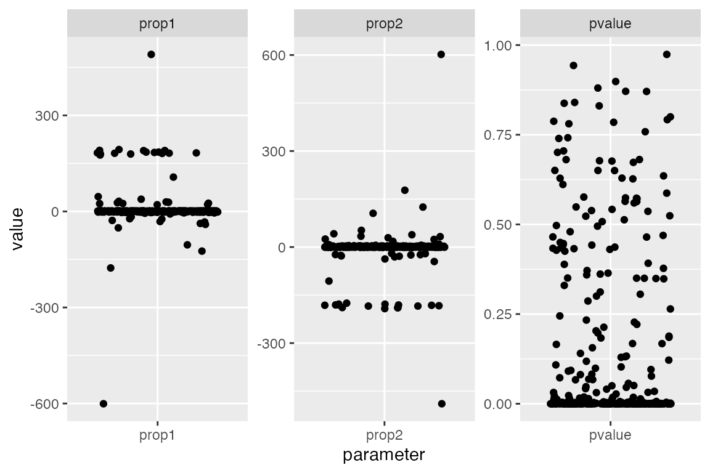
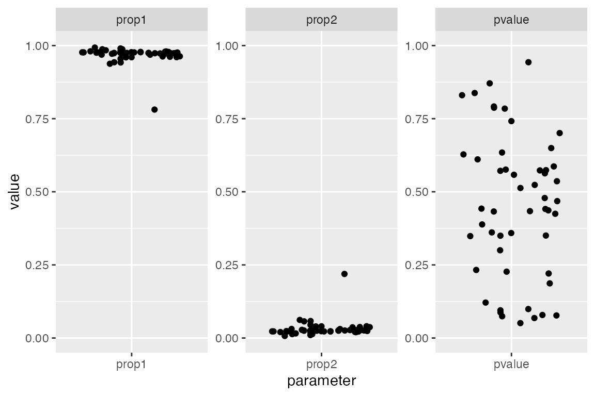

# Running qpAdm models with the 'rotation' strategy

**Note:** The functionality described in this vignette is still quite
experimental. Please keep this in mind when running qpAdm analyses and
be extra careful when drawing conclusions. Feedback, criticisms and
suggestions on this functionality are more then welcome!

## Introduction

qpAdm model fitting is a complex topic. To navigate it successfuly
requires solid knowledge of the $`f`$-statistics theory first introduced
by Nick Patterson and colleagues [in
2012](https://academic.oup.com/genetics/article/192/3/1065/5935193). As
part of our
[tutorial](https://bodkan.net/slendr/articles/vignette-01-tutorial.md),
we have looked at a very basic overview of the qpAdm-related
functionality implemented in *admixr*. We also talked about the most
important resources for learning more about this powerful method
pioneered by Iosif Lazaridis in
[2015](https://www.nature.com/articles/nature14317).

Recently, Harney *et al.* published an exciting paper called [“Assessing
the Performance of qpAdm: A Statistical Tool for Studying Population
Admixture”](https://academic.oup.com/genetics/article/217/4/iyaa045/6070149).
Before we go any further, I encourage everyone to read it and the superb
tutorial/guide available as its supplementary PDF. There really isn’t a
better source of information on how to run and interpret qpAdm analyses.

Please, only attempt to run qpAdm if you have familiarized yoursef with
all of the above-mentioned resources. I have had many people ask
questions via email (not only about qpAdm but also other topics) to
which the only sensible answer was - “you have to read the papers and
understand the statistics first.” I know it’s frustrating but there
really are no shortcuts here.

## *qpAdm* “rotation”

If you have ever worked with *qpAdm*, you are well aware of the
intricacies of finding the most suitable set of models that can explain
the data. Among other things, we have to make a decision about the
number of admixture sources and which populations are the most
appropriate surrogates for those source populations (because only rarely
we have sampled them directly). Furthermore, we need to carefully choose
a number of so called ‘outgroup’ populations (also called ‘references’
or ‘right’ populations, depending on whom you talk to).

The above mentioned paper by Harney *et al.* described an interesting
idea to find a set of the most appropriate models (i.e. combinations of
source and outgroup populations) which has been sucessfully used in the
past. They call the method a “rotating population” strategy.

This approach starts by defining a set of “candidate” populations from
which we iteratively sample a defined number of “sources” of ancestry
for our “target” population of interest (most commonly two or three
sources). After removing the sources from the candidate list, we then
define all the remaining populations as “outgroups”. Finally, we
iteratively fit qpAdm models for each combination of target, sources and
outgroups, extracting $`p`$-values and other statistics of interest.
After finishing the exhaustive fitting of source-outgroup combinations,
we examine all explored models, selecting those that seem most
appropriate.

## Implementation in *admixr*

In *admixr*, I have implemented a function
[`qpAdm_rotation()`](https://bodkan.net/slendr/reference/qpAdm_rotation.md)
which does exactly what is described paragraph with one additional
feature. Given the sensitivity of *qpAdm* to large numbers of potential
outgroups (references), for each combination of sources and outgroups we
also explore models for all possible *subsets* of outgroups. This is to
find models which are as small as possible, possibly determining which
outgroups are potentially redundant and not actually needed.

Let’s say that we have a target population *T* and a set of candidates
for potential sources and outgroups *C* = {a, b, c, d, e, f}. Then, if
we imagine an iteration of the rotation scheme in which we fixed sources
*S* = {a, b}, we have remaining candidates for outgroups *C - S* = {c,
d, e, f}. The basic implementation of the rotation procedure would
simply take *C - S* as the full set of outgroups and fitted the
following model:

- model \#1: target *T*, sources *S* = {a, b} and outgroups = {c, d, e,
  f}

However, in *admixr*, we would evaluate the following models in addition
to the model \#1:

- model \#2: target *T*, sources *S* = {a, b} and outgroups = {c, d, e}
- model \#3: target *T*, sources *S* = {a, b} and outgroups = {c, d, f}
- model \#4: target *T*, sources *S* = {a, b} and outgroups = {c, e, f}
- model \#5: target *T*, sources *S* = {a, b} and outgroups = {d, e, f}.

Therefore, our implementation in
[`qpAdm_rotation()`](https://bodkan.net/slendr/reference/qpAdm_rotation.md)
explores all posible outgroup combinations, allowing us to look for the
*smallest* model (in terms of outgroup size) that can explain our data.

## Concrete example

### Performing exhaustive search by rotating sources/outgroups

As an example, let’s revisit the problem of estimating the level of
Neandertal ancestry in a French person from the main tutorial. We use
this as an illustration because:

1.  It’s the simplest possible analysis one could do with *qpAdm*.
2.  It gives us a clear expectation of what the “truth” is.
3.  It gives us a clear expectation of what models we should
    *definitely* reject.

First, let’s download and install a development version of *admixr* to
get access to the new features, and download a small example data set:

``` r

library(admixr)

snps <- eigenstrat(download_data(dirname = tempdir()))
```

These are the individuals for which we have genotype data:

``` r

read_ind(snps)
#> # A tibble: 12 × 3
#>    id          sex   label      
#>    <chr>       <chr> <chr>      
#>  1 Chimp       U     Chimp      
#>  2 Mbuti       U     Mbuti      
#>  3 Yoruba      U     Yoruba     
#>  4 Khomani_San U     Khomani_San
#>  5 Han         U     Han        
#>  6 Dinka       U     Dinka      
#>  7 Sardinian   U     Sardinian  
#>  8 Papuan      U     Papuan     
#>  9 French      U     French     
#> 10 Vindija     U     Vindija    
#> 11 Altai       U     Altai      
#> 12 Denisova    U     Denisova
```

The
[`qpAdm_rotation()`](https://bodkan.net/slendr/reference/qpAdm_rotation.md)
function is very simple. It accepts:

- a name of the target population,
- a list of candidate populations,
- a logical parameter `minimize`, determining whether to perform the
  “minimization” of the outgroup size described in the previous section,
- the assumed number of sources of ancestry,
- the number of CPU cores to use for analysis (be careful with this
  options as many ADMIXTOOLS analyses run in parallel can consume *a
  lot* of memory!),
- parameter `fulloutput` specifying whether we want to have all the
  “ranks” and “subsets/patterns” statistics (see the main tutorial for
  more information) or if we just want the proportions of ancestry and
  significance values for individual models (this is the default, i.e.
  `fulloutput = FALSE`).

So, let’s say we are interested in finding the proportions of archaic
human ancestry in a French individual, and we also want to see what
sorts of possible models we could find that match archaic introgression.
We would run the following:

``` r

models <- qpAdm_rotation(
    data = snps,
    target = "French",
    candidates = c("Dinka", "Mbuti", "Yoruba", "Vindija", "Altai", "Denisova", "Chimp"),
    minimize = TRUE,
    nsources = 2,
    ncores = 2,
    fulloutput = TRUE
)
```

Here is what the full output looks like:

``` r

models
#> $proportions
#> # A tibble: 336 × 13
#>    model target source1 source2 outgroups    noutgroups  pvalue    prop1   prop2
#>    <chr> <chr>  <chr>   <chr>   <chr>             <int>   <dbl>    <dbl>   <dbl>
#>  1 m1    French Dinka   Mbuti   Yoruba & Vi…          3 3.87e-2    0.757   0.243
#>  2 m2    French Dinka   Mbuti   Yoruba & Vi…          3 1.55e-2    0.774   0.226
#>  3 m3    French Dinka   Mbuti   Yoruba & Vi…          3 3.49e-7    0.895   0.105
#>  4 m4    French Dinka   Mbuti   Yoruba & Al…          3 6.83e-2    0.781   0.219
#>  5 m5    French Dinka   Mbuti   Yoruba & Al…          3 6.59e-6    0.892   0.108
#>  6 m6    French Dinka   Mbuti   Yoruba & De…          3 3.99e-3    0.89    0.11 
#>  7 m7    French Dinka   Mbuti   Vindija & A…          3 6.69e-2   -8.09    9.09 
#>  8 m8    French Dinka   Mbuti   Vindija & A…          3 4.64e-1   45.9   -44.9  
#>  9 m9    French Dinka   Mbuti   Vindija & D…          3 1.88e-1 -180.    181.   
#> 10 m10   French Dinka   Mbuti   Altai & Den…          3 1.33e-1  -37.8    38.8  
#> # ℹ 326 more rows
#> # ℹ 4 more variables: stderr1 <dbl>, stderr2 <dbl>, nsnps_used <dbl>,
#> #   nsnps_target <dbl>
#> 
#> $ranks
#> # A tibble: 672 × 9
#>    model target  rank    df chisq        tail dfdiff chisqdiff    taildiff
#>    <chr> <chr>  <dbl> <dbl> <dbl>       <dbl>  <dbl>     <dbl>       <dbl>
#>  1 m1    French     1     1  4.27 0.0387           3     -4.27 1          
#>  2 m1    French     2     0  0    1                1      4.27 0.0387     
#>  3 m10   French     1     1  5.86 0.0155           3     -5.86 1          
#>  4 m10   French     2     0  0    1                1      5.86 0.0155     
#>  5 m100  French     1     1 26.0  0.000000349      3    -26.0  1          
#>  6 m100  French     2     0  0    1                1     26.0  0.000000349
#>  7 m101  French     1     1  3.32 0.0683           3     -3.32 1          
#>  8 m101  French     2     0  0    1                1      3.32 0.0683     
#>  9 m102  French     1     1 20.3  0.00000659       3    -20.3  1          
#> 10 m102  French     2     0  0    1                1     20.3  0.00000659 
#> # ℹ 662 more rows
#> 
#> $subsets
#> # A tibble: 1,008 × 12
#>    model target source1 source2 pattern    wt   dof  chisq      tail prop1 prop2
#>    <chr> <chr>  <chr>   <chr>   <chr>   <dbl> <dbl>  <dbl>     <dbl> <dbl> <dbl>
#>  1 m1    French Dinka   Mbuti   00          0     1   4.27   3.87e-2 0.757 0.243
#>  2 m1    French Dinka   Mbuti   01          1     2  23.5    7.87e-6 1     0    
#>  3 m1    French Dinka   Mbuti   10          1     2 160.     0       0     1    
#>  4 m10   French Dinka   Mbuti   00          0     1   5.86   1.55e-2 0.774 0.226
#>  5 m10   French Dinka   Mbuti   01          1     2  23.1    9.50e-6 1     0    
#>  6 m10   French Dinka   Mbuti   10          1     2 162.     0       0     1    
#>  7 m100  French Dinka   Mbuti   00          0     1  26.0    3.49e-7 0.895 0.105
#>  8 m100  French Dinka   Mbuti   01          1     2  30.6    2.22e-7 1     0    
#>  9 m100  French Dinka   Mbuti   10          1     2 287.     0       0     1    
#> 10 m101  French Dinka   Mbuti   00          0     1   3.32   6.83e-2 0.781 0.219
#> # ℹ 998 more rows
#> # ℹ 1 more variable: comment <chr>
```

We can see a list with three components, as we would expect from any
other [`qpAdm()`](https://bodkan.net/slendr/reference/qpAdm.md) run
(again, see the manual page and the tutorial for description of all
three elements and their meaning). The first column of each component is
always named `model` - this contains a short identifier of each
individual “rotation” run (i.e., a combination target & sources &
outgroups). It’s values don’t have any particular meaning - the order is
completely arbitrary!, This variable is useful for later filtering and
examination of individual models in detail.

Let’s ignore the `$ranks` and `$subsets` elements for now. We will focus
only on the first element, `$proportions` which contains the main
*qpAdm* summary.

### Examining and filtering fitted models

The `$proportions` table shown above contains information about *all*
models, regardless of their plausibility. We can see that by examining
the distributions of p-values (column `pvalue`) and admixture
proportions (columns `prop1` and `prop2`) of each evaluated model in the
figure below.

Notice two things (each dot represents one examined *qpAdm* model):

- Many models have inferred admixture proportions *way* outside the \[0,
  1\] interval - those are clearly nonsensical.
- Many models have very low p-values - this means these are incompatible
  with the data and can be rejected.

``` r

library(dplyr)
library(tidyr)
library(ggplot2)

select(models$proportions, model, pvalue, prop1, prop2) %>%
    gather(parameter, value, -model) %>%
    ggplot(aes(parameter, value)) +
    geom_jitter() +
    facet_wrap(~ parameter, scales = "free")
```



To make it easier to narrow down the list of all models, *admixr*
package contains a function
[`qpAdm_filter()`](https://bodkan.net/slendr/reference/qpAdm_filter.md).
This function accepts the result of the
[`qpAdm_rotation()`](https://bodkan.net/slendr/reference/qpAdm_rotation.md)
function (either the `fulloutput = TRUE` version or the simple data
frame with admixture proportions, p-values etc. produced by
using`fulloutput = FALSE`) and filters out models with any of the
proportions outside of the \[0, 1\] range and with p-values lower than a
specified cutoff (0.05 by default):

``` r

# filter out models which can clearly be rejected
fits <- qpAdm_filter(models)
```

We can verify that the filtering worked by visualizing the filtered set
of models again. Note that the p-values are distributed across the range
of “insigificance” (i.e., “non-rejection”) between \[0.05, 1.0\].
Furthermore - remember that we originally set out to find combinations
of sources-outgroups that model archaic ancestry in a French individual?
We can clearly see two tidy clusters of estimated ancestry proportions.
One is very small (this corresponds to the Neandertal component in
modern humans - we would expect about 2-3% based on many previous
analyses) and one large (“modern human” component, non-Neandertal
ancestry):

``` r

select(fits$proportions, model, pvalue, prop1, prop2) %>%
    gather(parameter, value, -model) %>%
    ggplot(aes(parameter, value)) +
    geom_jitter() +
    facet_wrap(~ parameter, scales = "free") +
    coord_cartesian(y = c(0, 1))
```



Let’s now focus only on the proportions table. We will also ignore a
couple of columns for brevity. Note that we are now also completely
ignoring p-values because we *cannot* used those for model selection -
they are *not* statistically meaningful at this stage! Higher p-value
*never* implies higher likelihood of the model. Finally, we order the
models based on the size of the outgroup set (smaller models first):

``` r

props <- fits$proportions %>%
    arrange(noutgroups) %>%
    select(-c(target, noutgroups, stderr1, stderr2, nsnps_used, nsnps_target))

print(props, n = Inf)
#> # A tibble: 51 × 7
#>    model source1 source2  outgroups                           pvalue prop1 prop2
#>    <chr> <chr>   <chr>    <chr>                                <dbl> <dbl> <dbl>
#>  1 m40   Dinka   Vindija  Yoruba & Altai & Chimp              0.943  0.975 0.025
#>  2 m81   Dinka   Chimp    Mbuti & Yoruba & Vindija            0.871  0.938 0.062
#>  3 m183  Yoruba  Vindija  Mbuti & Altai & Denisova            0.838  0.993 0.007
#>  4 m52   Dinka   Altai    Mbuti & Vindija & Denisova          0.830  0.977 0.023
#>  5 m82   Dinka   Chimp    Mbuti & Yoruba & Altai              0.787  0.943 0.057
#>  6 m56   Dinka   Altai    Yoruba & Vindija & Chimp            0.785  0.972 0.028
#>  7 m65   Dinka   Denisova Mbuti & Yoruba & Vindija            0.742  0.96  0.04 
#>  8 m66   Dinka   Denisova Mbuti & Yoruba & Altai              0.701  0.963 0.037
#>  9 m55   Dinka   Altai    Yoruba & Vindija & Denisova         0.587  0.974 0.026
#> 10 m83   Dinka   Chimp    Mbuti & Yoruba & Denisova           0.576  0.96  0.04 
#> 11 m50   Dinka   Altai    Mbuti & Yoruba & Denisova           0.574  0.973 0.027
#> 12 m34   Dinka   Vindija  Mbuti & Yoruba & Denisova           0.573  0.973 0.027
#> 13 m199  Yoruba  Altai    Mbuti & Vindija & Denisova          0.572  0.99  0.01 
#> 14 m36   Dinka   Vindija  Mbuti & Altai & Denisova            0.563  0.979 0.021
#> 15 m49   Dinka   Altai    Mbuti & Yoruba & Vindija            0.536  0.975 0.025
#> 16 m33   Dinka   Vindija  Mbuti & Yoruba & Altai              0.513  0.977 0.023
#> 17 m41   Dinka   Vindija  Yoruba & Denisova & Chimp           0.442  0.969 0.031
#> 18 m37   Dinka   Vindija  Mbuti & Altai & Chimp               0.436  0.978 0.022
#> 19 m57   Dinka   Altai    Yoruba & Denisova & Chimp           0.434  0.969 0.031
#> 20 m233  Yoruba  Chimp    Mbuti & Altai & Denisova            0.388  0.987 0.013
#> 21 m58   Dinka   Altai    Vindija & Denisova & Chimp          0.361  0.972 0.028
#> 22 m39   Dinka   Vindija  Yoruba & Altai & Denisova           0.359  0.977 0.023
#> 23 m35   Dinka   Vindija  Mbuti & Yoruba & Chimp              0.350  0.98  0.02 
#> 24 m67   Dinka   Denisova Mbuti & Yoruba & Chimp              0.350  0.981 0.019
#> 25 m51   Dinka   Altai    Mbuti & Yoruba & Chimp              0.348  0.98  0.02 
#> 26 m53   Dinka   Altai    Mbuti & Vindija & Chimp             0.300  0.975 0.025
#> 27 m42   Dinka   Vindija  Altai & Denisova & Chimp            0.233  0.976 0.024
#> 28 m38   Dinka   Vindija  Mbuti & Denisova & Chimp            0.227  0.975 0.025
#> 29 m54   Dinka   Altai    Mbuti & Denisova & Chimp            0.221  0.975 0.025
#> 30 m232  Yoruba  Chimp    Mbuti & Vindija & Denisova          0.121  0.984 0.016
#> 31 m202  Yoruba  Altai    Vindija & Denisova & Chimp          0.0988 0.974 0.026
#> 32 m68   Dinka   Denisova Mbuti & Vindija & Altai             0.0790 0.963 0.037
#> 33 m71   Dinka   Denisova Yoruba & Vindija & Altai            0.0770 0.96  0.04 
#> 34 m215  Yoruba  Denisova Mbuti & Vindija & Altai             0.0742 0.987 0.013
#> 35 m4    Dinka   Mbuti    Yoruba & Altai & Denisova           0.0683 0.781 0.219
#> 36 m186  Yoruba  Vindija  Altai & Denisova & Chimp            0.0507 0.978 0.022
#> 37 m59   Dinka   Altai    Mbuti & Yoruba & Vindija & Denisova 0.792  0.975 0.025
#> 38 m63   Dinka   Altai    Yoruba & Vindija & Denisova & Chimp 0.649  0.973 0.027
#> 39 m43   Dinka   Vindija  Mbuti & Yoruba & Altai & Denisova   0.628  0.977 0.023
#> 40 m44   Dinka   Vindija  Mbuti & Yoruba & Altai & Chimp      0.611  0.977 0.023
#> 41 m60   Dinka   Altai    Mbuti & Yoruba & Vindija & Chimp    0.524  0.974 0.026
#> 42 m62   Dinka   Altai    Mbuti & Vindija & Denisova & Chimp  0.479  0.975 0.025
#> 43 m47   Dinka   Vindija  Yoruba & Altai & Denisova & Chimp   0.468  0.976 0.024
#> 44 m46   Dinka   Vindija  Mbuti & Altai & Denisova & Chimp    0.441  0.978 0.022
#> 45 m45   Dinka   Vindija  Mbuti & Yoruba & Denisova & Chimp   0.433  0.974 0.026
#> 46 m61   Dinka   Altai    Mbuti & Yoruba & Denisova & Chimp   0.425  0.974 0.026
#> 47 m75   Dinka   Denisova Mbuti & Yoruba & Vindija & Altai    0.187  0.962 0.038
#> 48 m93   Dinka   Chimp    Mbuti & Yoruba & Altai & Denisova   0.0948 0.955 0.045
#> 49 m91   Dinka   Chimp    Mbuti & Yoruba & Vindija & Altai    0.0873 0.942 0.058
#> 50 m64   Dinka   Altai    Mbuti & Yoruba & Vindija & Denisov… 0.634  0.974 0.026
#> 51 m48   Dinka   Vindija  Mbuti & Yoruba & Altai & Denisova … 0.558  0.977 0.023
```

Fun fact: notice in the table below that there are many models in which
the chimpanzee was fitted as a source of ancestry! Interestingly, qpAdm
used Chimp to infer archaic human ancestry. This is because you could
think of Neandertal ancestry as an “ancestral component” of a modern
human genome and the *qpAdm* rotation procedure therefore concludes that
Chimpanzee is not be an unreasonable surrogate for a source population.
Of course, we know there are better sources in our candidates set - we
have the archaic humans!

``` r

filter(props, source1 == "Chimp" | source2 == "Chimp")
#> # A tibble: 7 × 7
#>   model source1 source2 outgroups                         pvalue prop1 prop2
#>   <chr> <chr>   <chr>   <chr>                              <dbl> <dbl> <dbl>
#> 1 m81   Dinka   Chimp   Mbuti & Yoruba & Vindija          0.871  0.938 0.062
#> 2 m82   Dinka   Chimp   Mbuti & Yoruba & Altai            0.787  0.943 0.057
#> 3 m83   Dinka   Chimp   Mbuti & Yoruba & Denisova         0.576  0.96  0.04 
#> 4 m233  Yoruba  Chimp   Mbuti & Altai & Denisova          0.388  0.987 0.013
#> 5 m232  Yoruba  Chimp   Mbuti & Vindija & Denisova        0.121  0.984 0.016
#> 6 m93   Dinka   Chimp   Mbuti & Yoruba & Altai & Denisova 0.0948 0.955 0.045
#> 7 m91   Dinka   Chimp   Mbuti & Yoruba & Vindija & Altai  0.0873 0.942 0.058
```

Another interesting fact: notice that the rotating population procedure
selected another plausible model characterizing the ancestry of the
French individual. However, this of course doesn’t represent Neandertal
introgression. What it might possibly represent is left as an exercise
for the reader… :)

``` r

filter(props, prop1 < 0.9, prop2 < 0.9)
#> # A tibble: 1 × 7
#>   model source1 source2 outgroups                 pvalue prop1 prop2
#>   <chr> <chr>   <chr>   <chr>                      <dbl> <dbl> <dbl>
#> 1 m4    Dinka   Mbuti   Yoruba & Altai & Denisova 0.0683 0.781 0.219
```

## Conclusions

At this stage of analysis, you would have to decide which of the models
produced by
[`qpAdm_filter()`](https://bodkan.net/slendr/reference/qpAdm_filter.md)
that cannot be immediately rejected are more reasonable than others and
why. Possibly based on both some prior knowledge and additional
statistics (such as the details information available in the full log
output information shown by
[`loginfo()`](https://bodkan.net/slendr/reference/loginfo.md)). You
could say that the *qpAdm* methodology, while rooted in strong
statistics, is from a certain point as much art as it is science.
Interpreting the results and finding the most appropriate models can be
quite a challenge.

Happy modeling and please, do [let me
know](https://github.com/bodkan/admixr/issues) if you discover bugs or
missing features. My goal with this tool is to streamline *qpAdm* model
fitting as much as possible and I can do it only with your input.

## Final remarks

1.  As a reminder, keep in mind that *admixr* gives you tools for
    filtering SNPs and also grouping samples into populations on the
    fly! You can easily process and group samples before plugging them
    into
    [`qpAdm_rotation()`](https://bodkan.net/slendr/reference/qpAdm_rotation.md)!

2.  Also note that you can use the function
    [`loginfo()`](https://bodkan.net/slendr/reference/loginfo.md) to
    examine the complete log output of any model by specifying the model
    identifier. This is helpful not only for debugging purposes but also
    for cases when you need a particular statistic in the full qpAdm log
    report which is not currently parsed by *admixr*:

``` r

loginfo(fits, "m40")
#> Full output log of qpAdm rotation for model 'm40':
#> ===================================================
#> 
#> qpAdm: parameter file: /var/folders/lq/bl36db_s6w908hnjkntdp4140000gn/T//RtmpQWUXRk/qpAdm__441215052.par
#> ### THE INPUT PARAMETERS
#> ##PARAMETER NAME: VALUE
#> genotypename: /var/folders/lq/bl36db_s6w908hnjkntdp4140000gn/T//RtmpQWUXRk/snps/snps.geno
#> snpname: /var/folders/lq/bl36db_s6w908hnjkntdp4140000gn/T//RtmpQWUXRk/snps/snps.snp
#> indivname: /var/folders/lq/bl36db_s6w908hnjkntdp4140000gn/T//RtmpQWUXRk/snps/snps.ind
#> popleft: /var/folders/lq/bl36db_s6w908hnjkntdp4140000gn/T//RtmpQWUXRk/qpAdm__441215052.popleft
#> popright: /var/folders/lq/bl36db_s6w908hnjkntdp4140000gn/T//RtmpQWUXRk/qpAdm__441215052.popright
#> ##  qpAdm -p /var/folders/lq/bl36db_s6w908hnjkntdp4140000gn/T//RtmpQWUXRk/qpAdm__441215052.par
#> ## qpAdm version: 2050
#> seed: -1141008442
#> allsnps set NO.  It is recommended that allsnps be set explicitly
#>  *** recommended that inbreed be explicitly set ***
#> inbreed set NO
#> 
#> left pops:
#>               French      1
#>                Dinka      1
#>              Vindija      1
#> 
#> right pops:
#>               Yoruba      1
#>                Altai      1
#>                Chimp      1
#> 
#> jackknife block size:     0.050
#> snps: 500000  indivs: 6
#> number of blocks for block jackknife: 547
#> ## ncols: 500000
#> coverage:               French 499434
#> coverage:                Dinka 499362
#> coverage:              Vindija 497544
#> coverage:               Yoruba 499246
#> coverage:                Altai 497729
#> coverage:                Chimp 491273
#> Effective number of blocks:   489.461
#> numsnps used: 492145
#> codimension 1
#> f4info: 
#> f4rank: 1 dof:      1 chisq:     0.005 tail:          0.943006656 dofdiff:      3 chisqdiff:    -0.005 taildiff:                    1
#> B:
#>           scale     1.000 
#>           Altai     1.299 
#>           Chimp     0.560 
#> A:
#>           scale    15.336 
#>           Dinka    -0.037 
#>         Vindija     1.414 
#> 
#> 
#> full rank
#> f4info: 
#> f4rank: 2 dof:      0 chisq:     0.000 tail:                    1 dofdiff:      1 chisqdiff:     0.005 taildiff:          0.943006656
#> B:
#>           scale   418.012    10.844 
#>           Altai    -1.297     1.299 
#>           Chimp    -0.564     0.560 
#> A:
#>           scale     1.414     1.414 
#>           Dinka     1.414     0.000 
#>         Vindija     0.000     1.414 
#> 
#> 
#> best coefficients:     0.975     0.025 
#> Jackknife mean:      0.974726215     0.025273785 
#>       std. errors:     0.005     0.005 
#> 
#> error covariance (* 1,000,000)
#>         25        -25 
#>        -25         25 
#> 
#> 
#> summ: French    2      0.943007     0.975     0.025         25        -25         25 
#> 
#>     fixed pat  wt  dof     chisq       tail prob
#>            00  0     1     0.005        0.943007     0.975     0.025 
#>            01  1     2    25.213     3.35003e-06     1.000     0.000 
#>            10  1     2 23591.722               0     0.000     1.000 
#> best pat:           00         0.943007              -  -
#> best pat:           01      3.35003e-06  chi(nested):    25.208 p-value for nested model:     5.14691e-07
#> 
#> coeffs:     0.975     0.025 
#> 
#> ## dscore:: f_4(Base, Fit, Rbase, right2)
#> ## genstat:: f_4(Base, Fit, right1, right2)
#> 
#> details:                Dinka                Altai    -0.003103   -4.440509
#> details:              Vindija                Altai     0.119761  147.146084
#> dscore:                Altai f4:     0.000001 Z:     0.001491
#> 
#> details:                Dinka                Chimp    -0.001349   -2.261712
#> details:              Vindija                Chimp     0.051628   78.030237
#> dscore:                Chimp f4:    -0.000010 Z:    -0.017670
#> 
#> gendstat:               Yoruba                Altai     0.001
#> gendstat:               Yoruba                Chimp    -0.018
#> gendstat:                Altai                Chimp    -0.029
#> 
#> worst Z-score with right hand mix
#> f4(Target, Fit, Base, mix of Right pops;  Z:    -0.033 sum:     1.000
#>                          Altai    -2.544
#>                          Chimp     3.544
#> 
#> oldmode set: terminating
#> ##end of qpAdm:        1.517 seconds cpu        0.000 Mbytes in use
```
